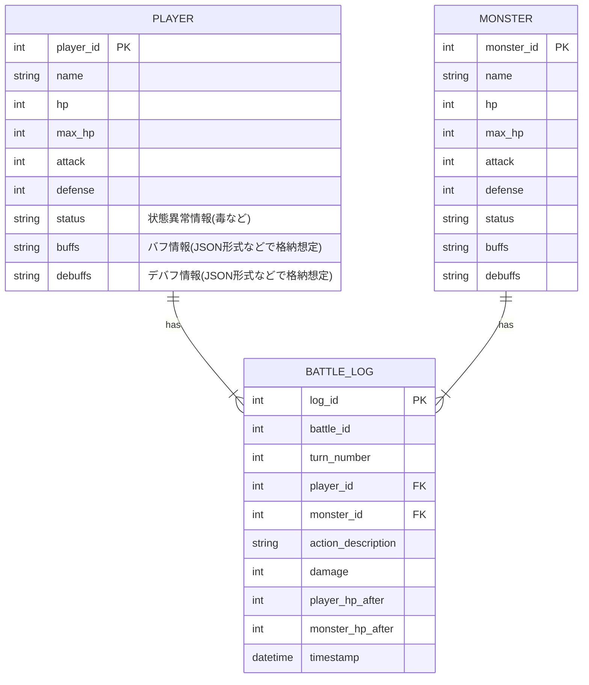
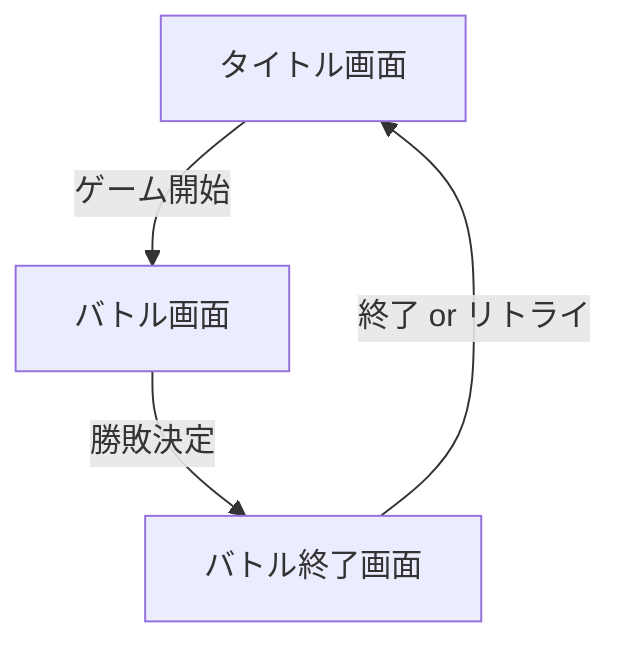

以下では、提示された要件定義書を踏まえた[ミニRPGアリーナ]の基本設計書をMarkdown形式で記述します。

---

## 1. システム構成図

本システムは、単一のコンソールアプリケーションとして構成されます。ユーザーはキーボードからアクションコマンドを入力し、Pythonアプリケーションがバトルロジックを処理して結果をコンソールに出力します。外部データベースや外部APIとの連携はなく、すべてプログラム内部の変数管理または必要に応じてローカルファイルへの書き出しのみを想定しています。

```mermaid
flowchart LR
    A[ユーザー] -- キーボード入力 --> B[コンソール (標準入力)]
    B -- コマンド/数値 --> C[Pythonアプリケーション]
    C -- バトル結果/ログ --> B[コンソール (標準出力)]
```

- **ユーザー**: キーボード操作でアクションを選択
- **コンソール**: ユーザーとアプリケーションの入出力を受け持つ
- **Pythonアプリケーション**: ゲームのメインロジック(バトル・HP管理・状態異常管理など)

---

## 2. アーキテクチャ設計

### 採用アーキテクチャパターン

#### レイヤードアーキテクチャ (Layered Architecture)

本システムはコンソールゲームであり大規模な画面表示やマイクロサービス分割の必要性は低いことから、**レイヤードアーキテクチャ**を採用します。

- **プレゼンテーション層 (UI層)**  
  コンソール入出力を管理する部分。ユーザー入力の取得・出力メッセージの表示などを担当。

- **アプリケーション層 (ビジネスロジック層)**  
  ゲームのバトルシーケンスやHP管理、状態異常ロジック、勝敗判定などの中核となる処理を担う。

- **データアクセス層**  
  今回は外部データベースに依存しない要件ですが、拡張でゲームデータをファイル保存する場合などに備えて、データ入出力・読み込み専用のモジュールを分割できるようにする。

#### 採用理由

- **保守性・拡張性**: レイヤーごとに役割を分割することで、機能追加や改修時の影響範囲を最小化できる。  
- **可読性**: コンソール入出力（UI）とゲームロジック（ビジネスロジック）、データ管理（ファイルI/Oなど）の切り分けが明確になる。

---

## 3. 外部インターフェース設計

### ユーザーからの入力

- **標準入力**: `input()`関数を使用してプレイヤーアクション（通常攻撃、防御、特殊攻撃、回復 など）を選択。
- **エラー・例外入力処理**: 不正なコマンドが入力された場合は再入力を促す。

### 外部システムとの連携

- **外部API**: なし  
- **ファイル入出力**: 現状は必須ではないが、戦闘ログやプレイヤー情報を保存する場合にローカルファイル（例：JSON）への出力を想定。

---

## 4. 主要機能のモジュール分割

以下のように主要な機能をモジュール単位で分割し、それぞれの責務を明確化します。

```plaintext
.
├─ app/
│   ├─ main.py            # エントリポイント: ゲーム起動部分
│   ├─ ui/
│   │   └─ menu.py        # メニュー表示やユーザー入力を受け付ける
│   ├─ core/
│   │   ├─ battle_manager.py   # バトル進行の管理(ターン管理・勝敗判定など)
│   │   ├─ action_manager.py   # アクションの実行、ダメージ計算、状態異常処理など
│   │   └─ logger.py           # ゲーム進行ログの出力
│   └─ models/
│       ├─ player.py      # Playerクラス: HP・ステータス・アクションロジックなど
│       ├─ monster.py     # Monsterクラス: HP・ステータス・行動パターンなど
│       └─ actions.py     # アクション関連クラス(通常攻撃・特殊攻撃など)
└─ ...
```

### 各モジュールの概要

1. **`ui/menu.py`**  
   - ユーザー入力を受け取り、バトル開始時やターンごとのアクションメニューを表示  
   - 不正入力があった場合のハンドリングを実装  

2. **`core/battle_manager.py`**  
   - ゲームの進行管理を担当（ターンのループ処理、行動順の管理、勝敗判定など）  
   - 各ターンごとにプレイヤーとモンスターのアクションを呼び出す  

3. **`core/action_manager.py`**  
   - プレイヤーが選択したアクションやモンスターの行動に応じて、ダメージ計算・状態異常付与・バフ/デバフ処理などを実行  
   - 乱数(`random`モジュール)を用いた攻撃変動や特殊効果の処理を行う  

4. **`core/logger.py`**  
   - 各ターンの行動内容、ダメージ量、HP残量などをコンソールやログファイルへ出力  
   - `logging`モジュールを用いてDEBUG/INFOレベルを使い分け可能にする  

5. **`models/player.py`**  
   - プレイヤーの情報（HP、攻撃力、防御力、状態異常、バフ/デバフなど）を管理するクラス  
   - 必要に応じて回復や特殊スキルロジックをメソッドとして持つ  

6. **`models/monster.py`**  
   - モンスターの情報（HP、攻撃力、防御力、状態異常など）を管理するクラス  
   - モンスターの行動パターン（ランダム・固定ロジックなど）をメソッドとして持つ  

7. **`models/actions.py`**  
   - 通常攻撃、特殊攻撃、防御、回復など各種アクションを定義するクラスや関数をまとめる  
   - 新しいアクションを追加しやすいよう抽象クラス (interface) にすることも検討  

8. **`main.py`**  
   - アプリケーションのエントリポイント  
   - プレイヤーやモンスターの初期化、バトル開始処理、結果表示などを呼び出す  

---

## 5. データベース設計 (ER図)

### 方針

要件上、「外部DBは使用しない」とあるため、**本設計ではゲーム内のデータをメモリ管理**する想定です。ただし、将来的にゲームデータを永続化する場合を想定して、最低限のER図とテーブル定義のサンプルを示します。  
実際には、Pythonのクラスやリスト/辞書を用いてインメモリで扱いますが、ER図としては下記のような関係性になります。

### ER図



- **PLAYERテーブル**: プレイヤーの基礎ステータスを保持  
- **MONSTERテーブル**: モンスターの基礎ステータスを保持  
- **BATTLE_LOGテーブル**: 1回の戦闘の中でターンごとに発生した行動・結果の履歴  

### テーブル定義例

#### PLAYERテーブル

| 項目名       | データ型   | キー   | 備考                       |
|--------------|------------|--------|----------------------------|
| player_id    | INT        | PK     | 自動採番など               |
| name         | VARCHAR(50)|        | プレイヤー名               |
| hp           | INT        |        | 現在HP                     |
| max_hp       | INT        |        | 最大HP                     |
| attack       | INT        |        | 攻撃力                     |
| defense      | INT        |        | 防御力                     |
| status       | VARCHAR(50)|        | 状態異常など               |
| buffs        | TEXT       |        | バフ情報（JSON形式想定）   |
| debuffs      | TEXT       |        | デバフ情報（JSON形式想定） |

#### MONSTERテーブル

| 項目名       | データ型   | キー   | 備考                       |
|--------------|------------|--------|----------------------------|
| monster_id   | INT        | PK     | 自動採番など               |
| name         | VARCHAR(50)|        | モンスター名               |
| hp           | INT        |        | 現在HP                     |
| max_hp       | INT        |        | 最大HP                     |
| attack       | INT        |        | 攻撃力                     |
| defense      | INT        |        | 防御力                     |
| status       | VARCHAR(50)|        | 状態異常など               |
| buffs        | TEXT       |        | バフ情報（JSON形式想定）   |
| debuffs      | TEXT       |        | デバフ情報（JSON形式想定） |

#### BATTLE_LOGテーブル

| 項目名             | データ型     | キー  | 備考                                            |
|--------------------|--------------|-------|-------------------------------------------------|
| log_id             | INT          | PK    | 自動採番など                                    |
| battle_id          | INT          |       | 1つの戦闘を識別するID(プレイヤー1体 vs モンスター1体) |
| turn_number        | INT          |       | ターン数                                        |
| player_id          | INT          | FK    | PLAYERテーブルの外部キー                        |
| monster_id         | INT          | FK    | MONSTERテーブルの外部キー                       |
| action_description | VARCHAR(255) |       | 行動内容の文字列（攻撃・防御など）              |
| damage             | INT          |       | 行動によるダメージ量                            |
| player_hp_after    | INT          |       | 行動後のプレイヤーHP                            |
| monster_hp_after   | INT          |       | 行動後のモンスターHP                            |
| timestamp          | DATETIME     |       | 行動を記録した日時                              |

---

## 6. 画面設計(任意)

### 画面レイアウト（コンソール表示）

コンソール画面はテキストベースで以下のような内容を表示します。

1. **タイトル画面**  
   ```
   ==========================
       ミニRPGアリーナ
   ==========================
   1) ゲーム開始
   2) 終了
   ```
   - ユーザーに対して開始／終了を選択させる。

2. **バトル画面**  
   - ターンの開始時に現在のステータスを表示
     ```
     --- Turn 1 ---
     [Player HP: 50/50]  [Monster HP: 30/30]
     ```
   - アクション選択メニューを表示
     ```
     1) 通常攻撃
     2) 防御
     3) 特殊攻撃
     4) 回復
     ```
   - 選択結果およびモンスターの行動結果を表示
     ```
     あなたは通常攻撃を選択した！
     モンスターに 8 のダメージを与えた！
     モンスターの攻撃！ あなたは 5 のダメージを受けた！
     [Player HP: 45/50]  [Monster HP: 22/30]
     ```

3. **バトル終了画面**  
   - プレイヤーまたはモンスターのHPが0以下になったら勝敗表示
     ```
     モンスターを倒した！あなたの勝利です！
     - または -
     あなたは力尽きた...ゲームオーバー
     ```

### 画面遷移図



- タイトル画面からバトルを開始し、バトル画面で連続ターンを進行。勝敗が決まるとバトル終了画面に遷移する。

---

## まとめ

本設計では、要件定義書で示された機能要件（ターン制バトル、プレイヤーアクション選択、HP管理、乱数要素導入、ゲーム終了判定、ゲームログ表示）と非機能要件（応答速度、可用性、保守性、運用性）を満たすために、**レイヤードアーキテクチャ**と**Python 3.x**を使用したコンソールアプリケーションの基本構成を示しました。

- **モジュール分割**により、保守性・拡張性が高い構造を実現
- **状態管理**(HP・バフ/デバフなど)や**乱数活用**により、ゲーム性を確保
- **拡張性**(新アクションや新モンスターの追加)を考慮したクラス設計

以上が、ミニRPGアリーナの基本設計書となります。今後の詳細設計・実装フェーズでは、各クラス・メソッドのインターフェース仕様や具体的なアルゴリズム、ログレベル設定などの詳細を詰めていきます。