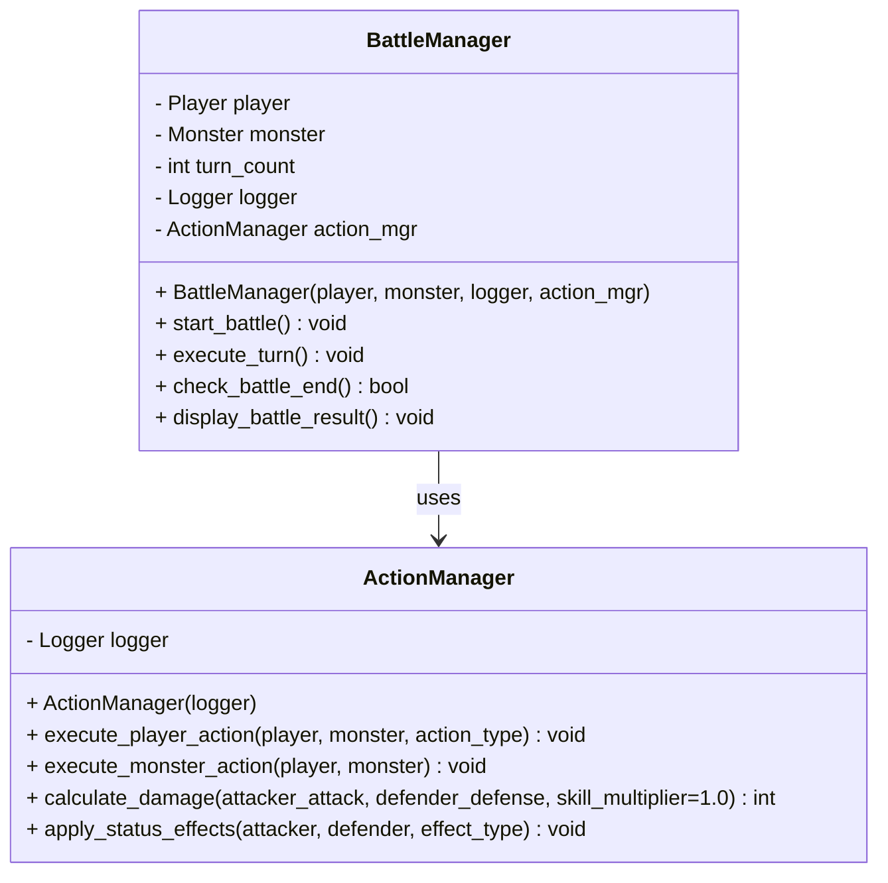
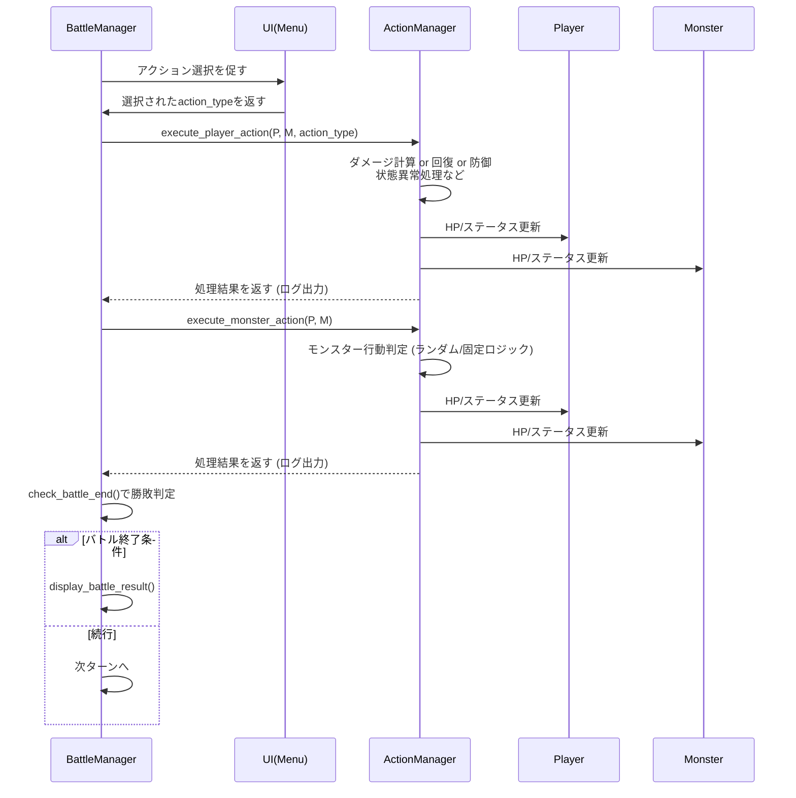

以下では、基本設計書の「4. 主要機能のモジュール分割」で定義したモジュールのうち、**バトル進行を司る `battle_manager.py`** と、実際のアクション（通常攻撃・特殊攻撃など）の処理を司る **`action_manager.py`** に対して、詳細設計を行います。  
設計内容は以下の項目に沿って記述します。

1. [モジュール内のクラス設計（クラス図）](#1-モジュール内のクラス設計クラス図)  
2. [主要な処理フロー（シーケンス図/アクティビティ図）](#2-主要な処理フローシーケンス図アクティビティ図)  
3. [データベーステーブル定義（物理設計）](#3-データベーステーブル定義物理設計)  
4. [エラー処理](#4-エラー処理)  
5. [性能考慮事項](#5-性能考慮事項)  
6. [セキュリティ考慮事項](#6-セキュリティ考慮事項)  

---

## 1. モジュール内のクラス設計（クラス図）

### 対象モジュール
- `core/battle_manager.py`
- `core/action_manager.py`

#### `core/battle_manager.py`
- **BattleManagerクラス**  
  - **責務**  
    - ゲームのターン管理（プレイヤー・モンスターの行動順序）
    - バトルの開始・終了条件の判定（HP<=0 のチェック）
    - 各ターンで発生するイベント（UIへのメニュー表示、アクション実行）の管理

  - **主な属性 (Attributes)**  
    | 属性名       | 型          | 説明                                     |
    |:------------|:------------|:-----------------------------------------|
    | `player`    | `Player`    | バトルに参加するプレイヤーオブジェクト   |
    | `monster`   | `Monster`   | バトルに参加するモンスターオブジェクト   |
    | `turn_count`| `int`       | 現在のターン数                           |
    | `logger`    | `Logger`    | バトルログ出力用のロガーインスタンス     |
    | `action_mgr`| `ActionManager` | アクション実行を行うマネージャ         |

  - **主なメソッド (Methods)**  
    | メソッド名             | 引数                            | 戻り値       | 説明                                                                                                   |
    |:-----------------------|:--------------------------------|:------------|:-------------------------------------------------------------------------------------------------------|
    | `__init__`            | `player: Player`, `monster: Monster`, `logger: Logger`, `action_mgr: ActionManager` | なし | プレイヤー、モンスター、ロガー、アクション管理クラスを受け取り、内部属性を初期化                       |
    | `start_battle()`      | なし                            | なし         | バトルのメインループを開始し、終了条件（勝敗）が決まるまでターンを進行させる                           |
    | `execute_turn()`      | なし                            | なし         | 1ターン分の処理を実施（プレイヤーアクション入力→実行→モンスターアクション実行→HP状態確認など）        |
    | `check_battle_end()`  | なし                            | `bool`       | プレイヤー or モンスターのHPが0以下かを判定し、バトル継続/終了を返す                                    |
    | `display_battle_result()` | なし                        | なし         | 勝敗結果をコンソールやログに出力                                                                        |

#### `core/action_manager.py`
- **ActionManagerクラス**  
  - **責務**  
    - プレイヤー/モンスターのアクションを実行し、ダメージ計算、バフ・デバフ、状態異常などの効果を適用
    - ランダム要素（クリティカル・与ダメージのブレ幅）の処理

  - **主な属性 (Attributes)**  
    | 属性名        | 型        | 説明                                              |
    |:-------------|:----------|:-------------------------------------------------|
    | `logger`     | `Logger`  | アクション結果を出力するためのロガーインスタンス   |

  - **主なメソッド (Methods)**  
    | メソッド名               | 引数                                                                          | 戻り値      | 説明                                                                               |
    |:-------------------------|:------------------------------------------------------------------------------|:-----------|:-----------------------------------------------------------------------------------|
    | `__init__`              | `logger: Logger`                                                               | なし       | ロガーの初期化                                                                     |
    | `execute_player_action()`| `player: Player`, `monster: Monster`, `action_type: str`                       | なし       | プレイヤーのアクション種別に応じた処理を行い、モンスターのHPや状態異常を更新        |
    | `execute_monster_action()`| `player: Player`, `monster: Monster`                                         | なし       | モンスターの行動パターン（ランダム or 固定ロジック）を決定し、ダメージや状態異常などを適用 |
    | `calculate_damage()`    | `attacker_attack: int`, `defender_defense: int`, `skill_multiplier: float=1.0` | `int`      | ダメージ計算を行う(攻撃力－防御力、乱数補正、スキル補正などを加味)                  |
    | `apply_status_effects()`| `attacker`, `defender`, `effect_type: str`                                     | なし       | 攻撃やスキルによる状態異常（毒・スタンなど）を付与する処理                         |

##### クラス図（Mermaid記法）

> **補足**: 依存関係として、`BattleManager` から `ActionManager` のメソッドを呼び出し、アクションの実行を行います。

---

## 2. 主要な処理フロー（シーケンス図/アクティビティ図）

ここでは、1ターンの処理フローをシーケンス図で示します。

### シーケンス図: 1ターンの流れ

1. **プレイヤーアクション選択**  
   - `BattleManager` は UI層(`menu.py`など)にプレイヤーのアクションを問い合わせる。  
   - 返却されたアクション種別に応じて `ActionManager` の `execute_player_action()` を呼び出す。

2. **プレイヤーアクションの実行**  
   - `ActionManager` は与ダメージ/回復などを計算し、`Player`や`Monster`のHPや状態異常を更新する。

3. **モンスターアクションの実行**  
   - `BattleManager` は `ActionManager` の `execute_monster_action()` を呼び出し、モンスターの行動を決定（乱数や事前設定）。
   - ダメージ/状態異常を適用し、`Player`や`Monster`のステータスを更新。

4. **バトル終了判定**  
   - `BattleManager` がバトル終了条件（HP<=0）をチェックし、決着した場合は結果表示→バトル終了。  
   - 決着がつかなければ次のターンへ進む。

---

## 3. データベーステーブル定義（物理設計）

本システムは**メモリ管理が主**ですが、**将来的な拡張**（戦闘ログなどの保存）を想定し、基本設計書のER図をもとに**物理設計**を行います。必要に応じてRDBやSQLiteを使用する想定です。

### テーブル一覧
- `PLAYER`
- `MONSTER`
- `BATTLE_LOG`

#### PLAYERテーブル

| 項目名    | データ型     | PK/UK/IDX | NOT NULL | デフォルト | 備考                             |
|:---------|:------------|:----------|:---------|:-----------|:---------------------------------|
| player_id| INT         | PK        | YES      | AUTO_INCREMENT | プレイヤーID                     |
| name     | VARCHAR(50) |           | YES      | なし        | プレイヤー名                     |
| hp       | INT         |           | YES      | 0          | 現在HP                           |
| max_hp   | INT         |           | YES      | 0          | 最大HP                           |
| attack   | INT         |           | YES      | 0          | 攻撃力                           |
| defense  | INT         |           | YES      | 0          | 防御力                           |
| status   | VARCHAR(50) |           | NO       | NULL       | 状態異常（毒など）の文字列表現   |
| buffs    | TEXT        |           | NO       | NULL       | バフ情報（JSON形式など）         |
| debuffs  | TEXT        |           | NO       | NULL       | デバフ情報（JSON形式など）       |

#### MONSTERテーブル

| 項目名     | データ型     | PK/UK/IDX | NOT NULL | デフォルト | 備考                               |
|:----------|:------------|:----------|:---------|:-----------|:-----------------------------------|
| monster_id| INT         | PK        | YES      | AUTO_INCREMENT | モンスターID                      |
| name      | VARCHAR(50) |           | YES      | なし        | モンスター名                       |
| hp        | INT         |           | YES      | 0          | 現在HP                             |
| max_hp    | INT         |           | YES      | 0          | 最大HP                             |
| attack    | INT         |           | YES      | 0          | 攻撃力                             |
| defense   | INT         |           | YES      | 0          | 防御力                             |
| status    | VARCHAR(50) |           | NO       | NULL       | 状態異常（毒など）の文字列表現     |
| buffs     | TEXT        |           | NO       | NULL       | バフ情報（JSON形式など）           |
| debuffs   | TEXT        |           | NO       | NULL       | デバフ情報（JSON形式など）         |

#### BATTLE_LOGテーブル

| 項目名              | データ型      | PK/UK/IDX | NOT NULL | デフォルト     | 備考                                       |
|:--------------------|:-------------|:----------|:---------|:---------------|:-------------------------------------------|
| log_id             | INT          | PK        | YES      | AUTO_INCREMENT | ログID                                     |
| battle_id          | INT          |            | YES      | なし           | バトルを一意に識別するID                  |
| turn_number        | INT          |            | YES      | なし           | ターン数                                   |
| player_id          | INT          | FK(PLAYER)| YES      | なし           | PLAYERテーブルの外部キー                  |
| monster_id         | INT          | FK(MONSTER)| YES     | なし           | MONSTERテーブルの外部キー                 |
| action_description | VARCHAR(255) |            | NO       | NULL           | 行動内容（通常攻撃、回復など）            |
| damage             | INT          |            | NO       | 0              | ダメージ量                                 |
| player_hp_after    | INT          |            | NO       | 0              | 行動後のプレイヤーHP                       |
| monster_hp_after   | INT          |            | NO       | 0              | 行動後のモンスターHP                       |
| timestamp          | DATETIME     |            | YES      | CURRENT_TIMESTAMP | ログ生成日時                             |

> **補足**: RDBを利用しない場合は、この構造をJSONファイルにそのまま格納したり、ORMを使わずPythonクラスのインスタンスで保持してもよいです。

---

## 4. エラー処理

### 想定されるエラー例
1. **ユーザー入力エラー**  
   - メニュー選択時に存在しないコマンドを入力  
   - **対処**: 再入力を促すメッセージを表示し、無限ループにならないようにエラーカウントを管理。  

2. **HP計算エラー（オーバーフロー/アンダーフロー）**  
   - HPが負の値、もしくは上限値を超えてしまう場合  
   - **対処**:  
     - 回復やバフの処理の際に `min(回復後HP, max_hp)` を適用  
     - ダメージ適用時には `max(ダメージ後HP, 0)` を適用  

3. **モンスター行動決定時のエラー**  
   - ランダム行動で例外的なアクション種別が返ってきた  
   - **対処**:  
     - モンスター行動ロジック内で定義済みのアクション以外は“通常攻撃”にフォールバック  
     - ログに警告を出す  

4. **DBアクセスエラー（拡張時）**  
   - 例：DB接続不良、INSERT失敗など  
   - **対処**:  
     - 例外をキャッチし、リトライまたはゲーム継続可否を判断  
     - DBに書き込めない場合はローカルファイルへの書き込みや、ログの一時保存を検討  

---

## 5. 性能考慮事項

1. **ターン制処理の軽量化**  
   - ターン実行ごとに大きな計算は行わない方針。  
   - ダメージ計算式や乱数処理は数回/ターン程度なので、通常のPCであれば問題ない。  

2. **ログ出力の集約**  
   - 毎行動時にDBやファイルへ書き込みを行うとI/Oが増加する  
   - 必要であればメモリにバッファリングして、ターン終了ごとなど、**バッチ的に書き込む**実装を検討  

3. **オブジェクトの再利用**  
   - 同じバトル内で同一プレイヤー、モンスターオブジェクトを使い回すため、初期化コストは低い  
   - 新バトル開始時のみオブジェクトを再生成  

---

## 6. セキュリティ考慮事項

1. **ユーザー入力のバリデーション**  
   - コンソール操作ではあるが、外部からの入力を**想定外の形式**（文字列・特殊文字等）で受け取る可能性がある  
   - 数値入力や選択肢入力の場合は、**厳格にバリデーション**し不正入力を排除  

2. **ログ出力の扱い**  
   - ログには内部処理に関する詳細情報（攻撃力やダメージ計算の乱数結果など）が含まれる  
   - デバッグ目的での詳細ログを**本番稼働時には制限**する仕組み（ログレベル切り替え）を用意  

3. **ファイル出力（拡張時）**  
   - ファイルパスの指定を**外部入力**から直接受け取らない  
   - 相対パスやパスTraversal攻撃を防止するため、**事前に定義した安全なディレクトリ**にのみ書き込む  

4. **DB使用時のSQLインジェクション対策**  
   - 今回はRDB連携が必須ではないが、将来的な拡張でSQLを発行する場合は**パラメータバインド**を利用し、文字列連結によるクエリ生成を避ける  

---

# まとめ

本詳細設計では、**バトル進行管理（BattleManager）** と **アクション実行管理（ActionManager）** を中心に、クラス図・シーケンス図・DB物理設計・エラー処理・性能面・セキュリティ面の観点を示しました。  

- **BattleManager**: バトル全体の進行と勝敗判定  
- **ActionManager**: 個々のアクション実行ロジック（ダメージ計算、状態異常の付与など）  

これらモジュールを中心として、今後は実装・単体テスト・総合テストの順で開発を進める想定です。新たなアクション追加や、モンスターのAI拡張などにも対応しやすいよう、クラス設計やDBスキーマを拡張可能にしてあります。